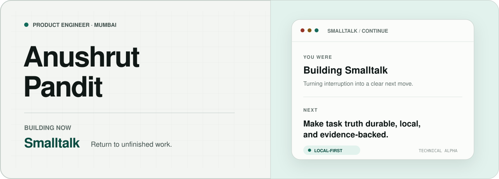

<picture>
  <source media="(prefers-color-scheme: dark) and (max-width: 640px)" srcset="./assets/profile-hero-mobile-dark.svg">
  <source media="(prefers-color-scheme: light) and (max-width: 640px)" srcset="./assets/profile-hero-mobile-light.svg">
  <source media="(prefers-color-scheme: dark)" srcset="./assets/profile-hero-dark.svg">
  <source media="(prefers-color-scheme: light)" srcset="./assets/profile-hero-light.svg">
  
</picture>

<p align="center">
  <a href="https://github.com/Anushlinux/smalltalk"><strong>Smalltalk</strong></a>
  &nbsp;·&nbsp;
  <a href="https://github.com/Anushlinux/smalltalk/releases/latest">Download for macOS</a>
  &nbsp;·&nbsp;
  <a href="https://x.com/Anushlinux">X</a>
  &nbsp;·&nbsp;
  <a href="https://www.linkedin.com/in/anushlinux">LinkedIn</a>
</p>

<p align="center">
  
</p>

## Building now

### [Smalltalk](https://github.com/Anushlinux/smalltalk)

**Leave any task. Come back to the right next move.**

Smalltalk is an open-source, local-first macOS app for returning to interrupted
work. It reconstructs the task you were working on, the point you reached, and
a safe next step from sparse local evidence. When the evidence is too thin, it
says so instead of inventing an answer.

I’m currently extending it from one-off recovery into a small,
self-maintaining task system:

- durable task truth with explicit history and restart-safe state;
- Continue answers bound to one task and that task’s own evidence;
- shadow proposals that can learn without changing the visible list;
- tightly gated automation that must earn authority from real-world accuracy.

> Captured activity is evidence. Model output is a proposal. Local validation
> decides what becomes task truth.

## Under the hood

```text
desktop       Rust · Tauri · Swift
interface     React · TypeScript
local truth   SQLite
hosted path   Cloudflare · Supabase
```

I care about product behavior that stays precise under uncertainty: safe
defaults, inspectable decisions, and systems that admit when they do not know.

<p align="center">
  <sub>Mumbai, India · building in public as <a href="https://github.com/Anushlinux">@Anushlinux</a></sub>
</p>
