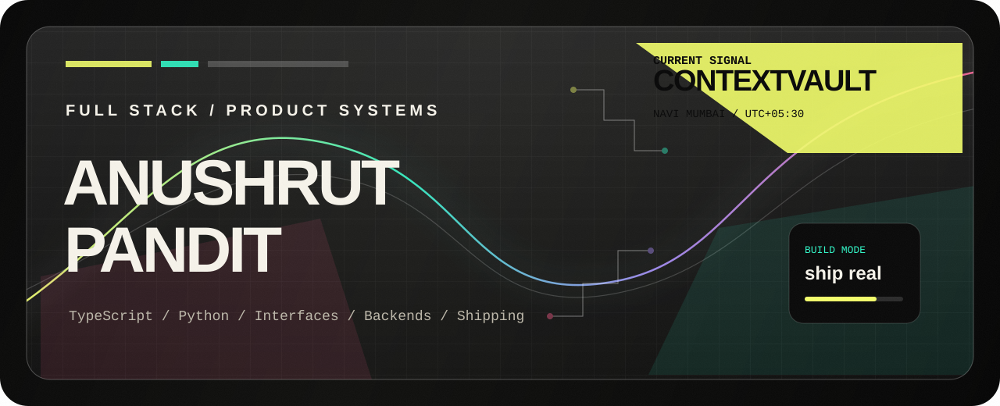
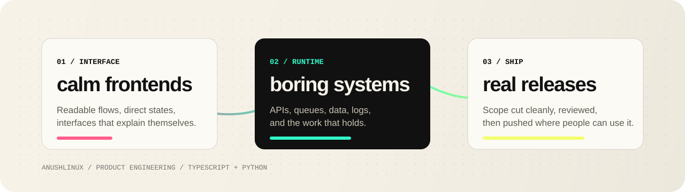

<p align="center">
  
</p>

<p align="center">
  <a href="https://twitter.com/anushrut43047">X / Twitter</a>
  &nbsp;&nbsp;/&nbsp;&nbsp;
  <a href="https://linkedin.com/in/anushrut-pandit">LinkedIn</a>
  &nbsp;&nbsp;/&nbsp;&nbsp;
  <a href="https://instagram.com/anushlinux">Instagram</a>
  &nbsp;&nbsp;/&nbsp;&nbsp;
  
</p>

## Anushrut Pandit

Full-stack developer from Navi Mumbai, India. I build product systems with
TypeScript, Python, sharp interfaces, and backend code that does not collapse
when the demo turns into real usage.

<p align="center">
  
</p>

## Now

- Building `Contextvault`.
- Turning rough ideas into usable product surfaces.
- Working close to the edge between frontend craft, backend reliability, and developer tooling.

## Stack

`TypeScript` `Python` `JavaScript` `React` `Next.js` `Vue` `Node.js`
`Django` `GraphQL` `PostgreSQL` `MongoDB` `Redis` `Supabase` `Docker`
`AWS` `GCP` `Linux`

## Signal

```txt
interface  -> calm, direct, fast
runtime    -> boring, observable, dependable
shipping   -> scoped, reviewed, real
```
