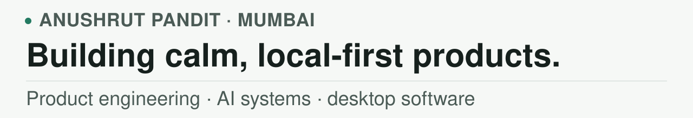

<picture>
  <source media="(prefers-color-scheme: dark)" srcset="./assets/profile-masthead-dark.svg">
  <source media="(prefers-color-scheme: light)" srcset="./assets/profile-masthead-light.svg">
  
</picture>

I’m a product engineer in Mumbai building local-first software and evidence-backed
AI systems. I’m currently focused on
[Smalltalk](https://github.com/Anushlinux/smalltalk), an open-source macOS app
that helps people return to interrupted work.

[Smalltalk](https://github.com/Anushlinux/smalltalk)
· [Download for macOS](https://github.com/Anushlinux/smalltalk/releases/latest)
· [X](https://x.com/Anushlinux)
· [LinkedIn](https://www.linkedin.com/in/anushlinux)

## Selected work

### [Smalltalk](https://github.com/Anushlinux/smalltalk)

A local-first macOS app that recovers what you were doing, where you left it,
and the next useful action from sparse local evidence. It keeps model output
bounded by inspectable facts and abstains when the evidence is too thin.

`Rust` · `Tauri` · `Swift` · `React` · `TypeScript` · `SQLite`

[Source](https://github.com/Anushlinux/smalltalk)
· [Latest macOS release](https://github.com/Anushlinux/smalltalk/releases/latest)

### Other projects

- **[Composio Integration Research](https://github.com/Anushlinux/research-assignment)** — An evidence-backed research pipeline for checking whether apps can be used as callable integrations. Missing evidence stays visible instead of being guessed.
- **[Ritual](https://github.com/Anushlinux/ritual)** — A local desktop automation project that explores Claude-powered tool use with explicit approval boundaries for risky operations.
- **[ChitChain](https://github.com/Anushlinux/ChitChain)** — A hackathon prototype for rotating savings and credit associations on Aptos, combining Move contracts with a Next.js wallet interface.

## How I build

- Local truth before model output.
- Honest uncertainty instead of invented answers.
- Calm interfaces backed by inspectable systems.

Mumbai, India · <a href="https://x.com/Anushlinux">X</a> · <a href="https://www.linkedin.com/in/anushlinux">LinkedIn</a>
